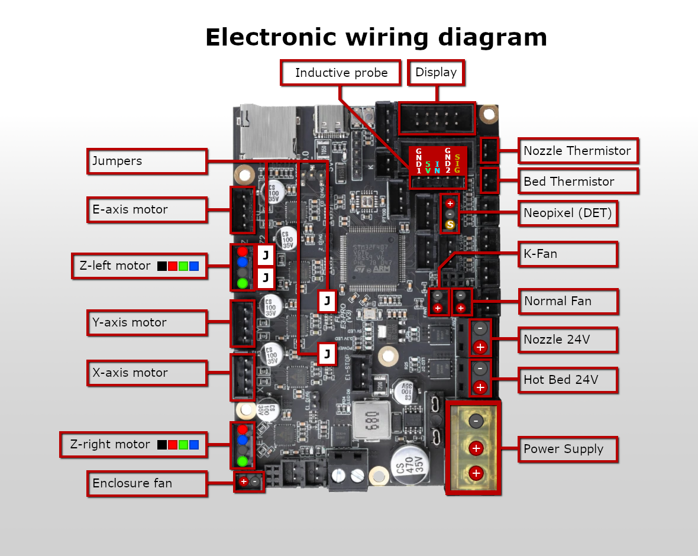
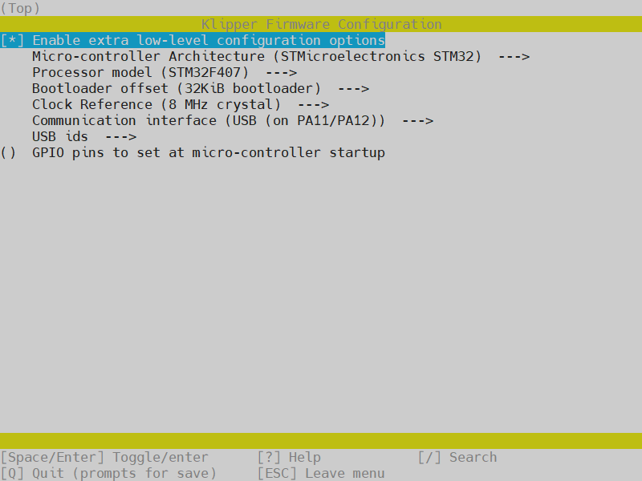

${\small{\textcolor{darkgrey}{\texttt{Release: V1.22}}}}$

# ⚠️⚙️ Sovol SV06/+ Fly-E3-PRO-V3 conversion ⚙️⚠️

This repository contains guide for the hardwareconversion for the Fly-E3-PRO-V3 & Klipper firmware for the **Sovol SV06** 3D printer. I made this as a branch in collaboration with Bassamantor archive a better accessibility for the whole community. The hardware conversion described here should fit the SV06+ but is untested yet. Guide and Klipper Config for the is WIP SV06+. Alos check out [Bassamanators](https://github.com/bassamanator/Sovol-SV06-firmware/tree/master) GitHub.

| Printer                                                         | Branch                                                                                    |
| --------------------------------------------------------------- | ----------------------------------------------------------------------------------------- |
| ${\normalsize{\textcolor{darkturquoise}{\texttt{Sovol SV06 Fly-E3-V3-Pro}}}}$ | ⚡ ${\small{\textcolor{darkturquoise}{\texttt{YOU ARE HERE}}}}$ ⚡          |
| Sovol SV06                                                      | [master](https://github.com/bassamanator/Sovol-SV06-firmware/tree/master)                 |
| Sovol SV06 Skr-Mini-E3-V3.0                                     | [skr-mini-e3-v3](https://github.com/bassamanator/Sovol-SV06-firmware/tree/skr-mini-e3-v3) |
| Sovol SV06 Plus                                                 | [sv06-plus](https://github.com/bassamanator/Sovol-SV06-firmware/tree/sv06-plus)           |
| All other printers                                              | [any-printer](https://github.com/bassamanator/Sovol-SV06-firmware/tree/any-printer)       |
 

**A short preview about what can you expect:**

(not realtime, speedup for better overview)


I am creating these files for my personal use and cannot be held responsible for what it might do to your printer. Use at your own risk.

## Outline
- [Contribution](#contribution)
- [Preface](#preface)
- [Disclaimer](#Disclaimer)
- [Features](#features)
- [Stay Up-to-Date](#stay-up-to-date)
- [Hardware Conversion](#Hardware-Conversion)
  - [BOM](#BOM)
  - [Step 1 - Electrical wiring](#Step-1---Electrical-wiring)
  - [Step 2 - Disassemble the mobo-box and ribbon-cable](#Step-2---Disassemble-the-mobo-box-and-ribbon-cable)
  - [Step 3 - Modifing Extruder Ribbon-Cable](#Step-3---Modifing-Extruder-ribbon-Cable)
  - [Step 4 - Modifing Mobo enclosure](#Step-4---Modifing-Mobo-enclosure)
  - [Step 5 - Stepper wiring](#Step-5---stepper-wiring)
  - [Step 6 - Assembly](Step-6---#assebmly)
  - [Step 7 - Optional Neopixel](#Step-7---Optional-Neopixel)
  - [Hardware conversion sources](#hardware-conversion-sources)
- [Klipper Installation](#klipper-installation)
  - [Before You Begin](#before-you-begin)
  - [Flash Firmware](#flash-firmware)
  - [Download OSS Klipper Configuration](#download-oss-klipper-configuration)
- [Initial Steps](#initial-steps)
  1. [Adjust Configuration with MCU Path](#adjust-configuration-with-mcu-path)
  2. [Configure Your Printer](#configure-your-printer)
- [Adjust Your Slicer](#adjust-your-slicer)
- [Support Me](#support-me)
- [Directory Structure](#directory-structure)
- [FAQ](#faq)
- [Useful Resources](#useful-resources)
- [Sovol Official Links](#sovol-official-links)
- [Sources](#sources)

## Contribution
:heart:I want to thank [Bassamanator](https://github.com/bassamanator/Sovol-SV06-firmware/tree/sv06) for sharing his Klipper-Config and giving me advice for the whole project. Further I thank [Jan Oerter](https://www.youtube.com/user/MegaMuelleimer/) and [Dominik Schmidt](https://www.youtube.com/@dr.klipper) for their Anycubic i3 Mega conversion that inspired me for this project. Please check out [their GitHub](https://github.com/Schmelzerboy/I3-Mega-Klipper&ved=2ahUKEwj_2fKx-8qEAxW__7sIHc9iDd8QFnoECBUQAQ&usg=AOvVaw2BVSSPE56Auy_gCTLLL8iX) as well. Last but not least I thank the big maker community for advice, troubleshooting and sharing awesome creations. Beeing part of a community give us a feeling of wholesome and connected. Without you and the regardless help this project wouldnt be possible. Youre breathtaking! :heart:

## Preface

This Mod includes minor manipulation of the provided hardware. If this mod doesnt work out for you, its reversable in majority. You have to live with some minor cosmetic changes of the mainboard enclosure.

Preassumtion is you have crimping and solder tools and know how to use them. Many helpful sources are provided here like :tv:**vidoes** :tv: and 🖼️**pictures**🖼️ to make the job easier. Keep in mind youre the only one that can be hold responsible if things go wrong.

Requirements:
- screw drivers
- soldering iron & flux
- crimptool for insulated Terminals
- shrink Tubes
- dupon Connectors
- heatgun
- pliers to cut and to Grab
- wire stripper
- helping hand
- small file(s)
- zipties

Everything in this guide aims for easy accessibility. Despite it the prerequisite for this guide is youre familiar with Klipper. This conversion is recommend advanced users which are familiar with handling electronics and used Klipper at least once before.

> [!CAUTION]
> ## DISCLAIMER:
> 🔥⚡💀⚡🔥
>
> The conversion needs modification of the PSU wiring. This contains the potential risk of damaging your machine, firehazard or worst threading your life. If you unshure how to do proceed stop right away and get help! Don't improvise at something that can potentialy threading your life when done improper! When turning on the machine first time after conversion I recommend having a fire extinguisher to hand for the worst case. If issues occoure leave feedback by opening an issue. Read the complete guide with full attention. I can not be hold accountable for any damage or injuries. Youre doing this at your own risk.
> 
> 🚨 some basic safety rules for electrical DIY 🚨:
> 1. Turn Off the machine and unplug the Power
> 2. Make shure it cant be plugged in or turned on again accidantial.
> 3. Don't be lazy but smart. Unplug and disassemble the parts you want to modify as far as possible to get them on a table.
> 4. Use proper tools.

## Features
- Harware:
  - Z-Tilt & Gantry Level to further improve parallel alignment to printbed.
  - silent Hotend-Fan while printer is idling. Optional PWM!
  - dedicated driver cooling fan. Optional PWM!
  - Optional: Neopixel with preconfigured effects for your printhead for better view and status feedback. 🔴🟢🔵 Full customization via `neopixel.cfg`
     - This Mod requieres a already installed mod for partcooling! Like [these](https://www.printables.com/de/model/685826-high-flow-ducts-for-sv06-single-and-double-5015-pa)
- Klipper:
   - This is basically provided by awesome Bassamanator. I only did minor changes to the `printer.cgf` to make it work with the Fly E3 Pro V3. Only the greatest masters are getting copyied, so credit goes to Bassamanator!
   - 💥 This Klipper configuration is an _endpoint_, meaning that it contains **everything** that you could possibly need in order to have an excellent Klipper experience! 💥
   - Minimum configuration settings for `Mainsail` and `Fluidd`.
   - Macros:
     - **Improved** mechanical gantry calibration/`G34` macro that provides the user audio feedback, and time to check the calibration.
     - Misc macros: `PRINT_START`, `CANCEL_PRINT`, `PRINT_END`, `PAUSE`, `RESUME`.
     - Parking macros (parks the printhead at various locations): `PARKFRONT`, `PARKFRONTLOW`, `PARKREAR`, `PARKCENTER`, `PARKBED`.
     - Load/unload filament macros.
     - `PURGE_LINE` macro.
     - `TEST_SPEED` macro. Find instructions [here](#how-do-i-use-the-test_speed-macro).
     - Custom Diplay Menu
     - Klipper Adaptive Meshing & Purging (KAMP) integrated. Read about it [here](#how-do-i-enable-kamp-klipper-adaptive-meshing--purging).

[🔼 Back to top](#outline)

## Stay Up-to-Date

${\normalsize{\textcolor{goldenrod}{\texttt{Star ⭐ this project.}}}}$


Watch for [updates]

[🔼 Back to top](#outline)

## Hardware Conversion
## BOM

This BOM is meant to give you an overview and some recommendation what is needed. Some parts are essential,  some can be done by DIY. Some there are a few parts with prequesitions. I marked them with the following pattern:
- essential :heavy_check_mark:
- DIY ⚙️
- prequesition :large_blue_diamond:
- optional: :small_orange_diamond:

> [!CAUTION]
> ⚡ If you like to improvise: Dont improvise on the wiring. Use at least a diameter of AWG14 or 2,0mm². Thinner cables lead to a non reliable voltage supply for to mobo with may unexpected behavior or worse. ⚡

| Essential | Need for Step  | Part | Price | Source |
| ----- | ----- | ---- | ----- | ------ |
| :heavy_check_mark: | Assembly  | Fly-E3-Pro-V3 | ~40 Money  | [AliExpress](https://a.aliexpress.com/_EwY8p5L) |
| :heavy_check_mark: | wiring  | 200cm each AWG14 Red & Black  | ~4 Money  | [AliExpress](https://a.aliexpress.com/_ExgydLn)  |
| :heavy_check_mark: | wiring  | Cable Lug 3xSV2-4 & 3xSV2-5 | ~5 Money  | [AliExpress](https://a.aliexpress.com/_Exw61D7)  |
| :heavy_check_mark: | wiring  | MR60 Connector | ~6 Money  | [AliExpress](https://a.aliexpress.com/_EzVy9PX)  |
| :heavy_check_mark: | wiring  | Wire sleeve (8mm ID) | ~1 Money  | [AliExpress](https://a.aliexpress.com/_EJrBNvF)  |
| :heavy_check_mark: | wiring  | Zipties 3.6mm width | ~2 Money  | [AliExpress](https://de.aliexpress.com/item/1005004666948984.html?spm=a2g0o.order_list.order_list_main.53.6abb5c5f54HL53&gatewayAdapt=glo2deu)  |
| :heavy_check_mark: | wiring  | Zipties 2.5mm width | ~2 Money  | [AliExpress](https://de.aliexpress.com/item/1005004666948984.html?spm=a2g0o.order_list.order_list_main.53.6abb5c5f54HL53&gatewayAdapt=glo2deu)  |
| ⚙️ | Soldering | 2x JST XH 2,54 2pins | ~ 1 Money | [AliExpress](https://de.aliexpress.com/item/32954418743.html?spm=a2g0o.order_list.order_list_main.29.564d5c5ftA02wT&gatewayAdapt=glo2deu)|
| ⚙️ | Soldering | 1x JST XH 2,54 3pins | ~ 1 Money | [AliExpress](https://de.aliexpress.com/item/32954418743.html?spm=a2g0o.order_list.order_list_main.29.564d5c5ftA02wT&gatewayAdapt=glo2deu)|
| ⚙️ | Soldering | 1x 5pin Female Dupont with wires | ~ 3 Money | [AliExpress](https://de.aliexpress.com/item/1005003638697583.html?spm=a2g0o.productlist.main.49.24cdbhKKbhKKDx&algo_pvid=dc7d4394-075d-4b5c-b441-6d431405c723&aem_p4p_detail=2024030500532316694723415837460000029320&algo_exp_id=dc7d4394-075d-4b5c-b441-6d431405c723-24&pdp_npi=4%40dis%21EUR%212.08%212.08%21%21%212.20%212.20%21%40211b619a17096288037974101e0a35%2112000026608429128%21sea%21DE%214565851420%21&curPageLogUid=ahmfexw1aSih&utparam-url=scene%3Asearch%7Cquery_from%3A&search_p4p_id=2024030500532316694723415837460000029320_5)|
| ⚙️ | Soldering | Alternative to Dupont wires | ~ 20 Money | [Local Amazon](https://www.amazon.de/dp/B0CLD7S5VC/?coliid=I2OEUBWMZKO5ZB&colid=3AEFYUODSS1J9&psc=1&ref_=list_c_wl_lv_ov_lig_dp_it)|
| ⚙️ |Stepper wiring| 50cm Stepper Wire | ~1 Money |[AliExpress]( https://a.aliexpress.com/_EHGpQVX) |
| ⚙️ |Stepper wiring| 80cm Stepper Wire | ~1 Money |[AliExpress]( https://a.aliexpress.com/_EHGpQVX) |
| :large_blue_diamond::small_orange_diamond: |Lighting| 4*1 Bit Neopixel | ~5 Money |[AliExpress](https://de.aliexpress.com/item/32962174474.html) |
| :heavy_check_mark: |Motivation| At least seven cookies or bits of sweets and a cup of hot drink 🍪🍬 | Depents on your taste |Anywhere |

## Step 1 - Electrical wiring
Requirements:
- AWG 14 wires
- MR60 Connector
- cable Lugs
- pliers
- wirestripper
- soldering iron
- crimping tool

> [!NOTE]
> This is the Part for the PSU-wiring to MOBO. You need to cut the wires and the sleeve in lenght, solder it with the connector and crimp the cable lugs.
> You may find this :tv:[video](https://youtu.be/w0pMjZ-rFQA?si=jAx5m2BBQhHhFl7G):tv: helpful for soldering and this :tv:[additional video](https://www.youtube.com/watch?v=GrwDEiFtXIc):tv: for applying the sleeve.

Procedure:
1. Use the pliers to cut the the materials in the length provided by this table:

| Quantity | Color  | Lenght | Needed for | 
| ----- | ----- | ---- | ----- |
| 2x | Red wire | 510 +/-10mm | connector to mobo |
| 1x | Black wire | 510 +/-10mm | connector to mobo |
| 2x | Red wire | 150 +/-5mm | PSU to connector |
| 1x | Black wire | 150 +/-5mm | PSU to connector |
| 1x | Protective sleeve | 470 +/-10mm | connector to mobo |
| 1x | Protective sleeve | 100 +/-10mm | PSU to connector |

> [!NOTE]
> The longer cables will be called CTM (connector to mobo), the short cables PSUC (PSU to connector) mind the 🖼️[electrical wiring diagram](#electrical-wiring-diagram)🖼️ to get an image of what you're about to archive.

2. Solder PSUC

Strip one end and solder all three 150mm wires it into the male connector. Use the helping hand to hold it in place. Round is for ground. A proper electrical connection is crucial as this connector is very likley to heat up and melt when there is a bad solderjoint. Apply the click-on insulation after inspecting the solder joint.

3. Solder CTM

Repeat the process with the three 510mm wires. Use the female connector.

4. Apply sleeve

Apply the sleeve to both wires and add a heatshrink to secure the sleeve and wires in place.

5. Crimping PSUC

Strip 6mm on the one end left and crimp the SV2-5(Bigger Fork) on all three cables. 

6. Crimping CTM

Repeat the process on the 510mm wires mentioned at 5. Use the SV2-4(smaller Fork)this time.

The result should look like this:
### Electrical wireing diagram


🍪🍬 DONE. Time for a cup of hot drink and a cookie or a sweet. 🍪🍬

[🔼 Back to top](#outline)
## Step 2 - Disassembly

Requirements:
- Pliers
- screwdriver with hexhead

> [!NOTE]
> In this step all electronical parts are gonna disassembled from the printers frame as preparation for following modifications. The motherboard enclosure, stepper cables, ribbon-cable and the motherboard from the enclosure.
> You will may find this :tv:[video](https://www.youtube.com/live/SQ4Nzgl77F8?si=rxNRZa5gnDLFytx2&t=866):tv: till timestamp 22:05 useful. Mind the 🖼️[Sovol SV06 Pinout](#sovol-sv06-pinout)🖼️.

Procedure:
1. Turn off the machine and unplug power!
2. open the enclosure.
3. unscrew the power supply terminals.
4. unscrew the hot bed terminals. 
5. unplug the hot bed thermistor.
6. unplug all stepper motor cables.
7. unplug 'touch screen'
8. cut and remove the zipties in the two bottom outlets that hold the cables **be careful not to cut a wire accidently.**
9. gently remove all wires from the bottom outlets.
    1. Stepper motor cables
    2. Hot bed
10. unplug the ribbon-cable from the extruder-pcb
    1. unplug Nozzle thermistor.
    2. unscrew the nozzle 24V terminals.
    3. unscrew the normal fan 24V terminals.
    4. unplug the controllable fan.
11. close the enclosure and hold it closed. Then unlock mobo-enclosure and remove the enclosure with the ribbon cable from the printers frame.
12. place the motherboard enclosure on a flat surface and open it again to proceed. 
13. cut the ziptie that hold the extruder-ribbon-cable, **Carefully again not to cut a wire accidently.**
14. disassemble the ribbon-cable from the mobo and the enclosure.
15. unscrew the four motherboard screws. Store the motherboard somewhere. If your conversion is successful you wount need it anymore. Keep the screws!
15. back to the printer the Y-motor-cable and dual-Z-motor-cable are taped together. Gently peel of the tape so they're seperated after.
16. remove the Dual-Z-stepper-cable and store it somewhere. If the conversion is sucessful you wount need it anymore.

### Sovol SV06 Pinout


🍪🍬 DONE. Time for a cup of hot drink and a cookie or a sweet. 🍪🍬

[🔼 Back to top](#outline)

## Step 3 - Modifing Extruder Ribbon-Cable

Requirements:
- Wirestripper
- Soldering iron
- flux
- helping hand
- multimeter
- pliers
- tape for marking

> [!NOTE]
> Modification of the toolhead ribbon cable is neccessary so it fits all the connectors on the Fly-E3-V3-Pro. 🖼️[Schematic 1](#schematic-1)🖼️ down below shows the original toolhead ribbon cable. 🖼️[Schematic 2](#schematic-2)🖼️ shows the final product after modification.

> [!TIP]
> If you having the spare toolhead laying around go and get it. It will be very helpful for this step. A spare toolhead pcb comes really handy as you can easily check if your wiring is as intended.

### schematic 1:


(click for lager picture)

### schematic 2:


(click for lager picture)

Procedure:
1. mark the cables for the probe with a tape so its easier to convert it. Mind the 🖼️[probe cable pinout](#probe-cable-pinout)🖼️.
2. cut the probe connector behind your marks cables and strip ~3mm.
3. cut the fan-ferrules from fan+ and fan- and strip ~3mm.
4. crimp or solder on the Dupont connector on the stripped probe-cables. Mind the 🖼️[probe cable pinout](#probe-cable-pinout)🖼️.
5. crimp or solder on JST-Connector on the stripped fan-cables.
6. check the polarity of the FAN. Mind the 🖼️[board pinout](#board-pinout)🖼️.
7. check the polarity of the K-FAN. Mind the 🖼️[board pinout](#board-pinout)🖼️.
8. check the pinout of the new probe-dupont-connector if it matches the Fly-E3-V3-pro. Mind the 🖼️[board pinout](#board-pinout)🖼️.
9. switch port 1 and 3 of the DET-Connector using the pliers.
10. (Optional) remove the tape marks from the probe-connector.

> [!TIP]
> Its possible to leave out the soldering or crimping job with the probe connetor by getting one of [these](https://www.amazon.de/dp/B0CLD7S5VC/?coliid=I2OEUBWMZKO5ZB&colid=3AEFYUODSS1J9&psc=1&ref_=list_c_wl_lv_ov_lig_dp_it) and make an adapter. Its not really necessary and more costly, but maybe this is a more convinient option for you.

### Probe cable pinout


### Board pinout
 

> [!CAUTION]
> I strongly recommend to check wiring with the multimeter and the toolhead pcb if everything is wired up correctly before calling this done.

🍪🍬 DONE. Time for a cup of hot drink and a cookie or a sweet. 🍪🍬

[🔼 Back to top](#outline)

## Step 4 - Modifing Mobo enclosure
Requirements:
- pliers
- small file - For myself I did it with a nail file
- paper towels

> [!NOTE]
> The moobo-enclosure needs minor modification so it fits the Fly-E3-V3-Pro. Mind the 🖼️[enclosure sanding visualization](#enclosure-sanding-visualization)🖼️.

Procedure:
1. Cut the ribs with the pliers marked red in the picture. We need to do that to make room for the Wifi-Antenna at the backside of the board.
2. Sand the holes with the file ~1 up 2mm wider so the USB-connector and SD-Card-slot fit of the Fly-Mobo fit.
3. Test if the Fly mobo fits into the enclosure. If not check for for connectors especially the SD-slot as it stand out alot. A few tries may required to get it right.
4. When the board fits nice and snuggely into the enclosure remove it again clean the enclosure with water and dry it with paper towels.

### Enclosure sanding visualization


🍪🍬 DONE. Time for a cup of hot drink and a cookie or a sweet. 🍪🍬

[🔼 Back to top](#outline)

## Step 5 - Stepper wiring
Requirements:
- pliers

> [!NOTE]
> The two new stepper motor cables need modification for correct wiring.

Procedure:
1. check the 4-pin-connector for orientation for both Z motor cables on the Fly-E3-Pro-V3. Mind the [Z-Motor cable chart](#z-motor-cable-chart).
2. use the pliers to remoove the pins on the motherboard connector. You can pinch on the pins with moderate force, they wount break. Bend the little nose up again befor inserting them back in their connector-housing. Mind the left sequence shown in the table below.
3. check the 6-pin connector for orientation of both cables on Z-steppers.
4. use the pliers to get the right orientation on stepper connector. Bend the little plastic-holders gently upwarts and remove the pins. **Dont try to push the pins, you will break them!**. Bend the nose back again before inserting them in their connector-housing. Mind the right sequence shown in the table below.

### Z-Motor cable chart
| ⚪ Motherboard (up to down)  | ⬜ Stepper (left to right) | 
| ----- | ---- |
| 🔴 | ⬛🟥🟩🟦 |
| 🔵 | |
| ⚫ | |
| 🟢 | |

The result should look like this after final assembly:

  

🍪🍬 DONE. Time for a cup of hot drink and a cookie or a sweet. 🍪🍬

[🔼 Back to top](#outline)

## Step 6 - Assembly
Requirements:
- pliers
- zipties
- screwdriver with hex-head

> [!NOTE]
> Put everything together in reverse oder of dissasembly and check if the board is turning on after.

Procedure:
1. placing the motherboard
   1. place the jumpers and the fuse on the Fly-E3-V3-Pro if you havent already.
   2. place the heatsinks on all drivers.
   3. get the Fly-E3-V3-Pro and screw it into the motherboard enclosure using the four screws we saved from the disassembly.
2. electrical wiring 🖼️[mind the electronic wiring diagram](#electronic-wiring-diagram)🖼️
   1. get the cable we prepared earlier at [Step1](#Step-1---Electrical-wiring) and screw down the the lug connectors in the board. Terminal 3 is for ground. The other two are for voltage.
   2. Route the Power power cable we just screw in down in the opening. Dont ziptie yet!
3. Install ribbon cable 🖼️[mind the electronic wiring diagram](#electronic-wiring-diagram)🖼️
   1. get the modified ribbon cable and place it in the upper opening of the enclosure. Secure it with a ziptie.
   2. plug in all the cables from the extruder ribbon cable.

>[!IMPORTANT]
> Mind the orientation of the modified sensor-dupont-connector! Mind the wiring diagram down below to get everything right. Close it after with the screw.

4. assemble enclosure
   1. place the enclosure at the printers-frame and lock it in place.
   2. screw in the bed power cables and the thermistor.
   3. Route the power cable in place. Its much more stiff now so its now bigger bend radius as we crossing your bed-cable. Dont worry it isnt an issue. Secure the two cables with a ziptie.

>[!IMPORTANT]
> Mind the picture below to get an idea what is mentioned here.

5. stepper wiring 🖼️[mind the electronic wiring diagram](#electronic-wiring-diagram)🖼️
   1. plug in the 20cm stepper motor cable at Z.
   2. plug in the Y stepper motor cable at Y.
   3. plug in the X stepper motor cable at X.
   4. plug in the 80cm stepper motor cable at E1 for the right stepper.
   5. route all the cables through the hole and secure them with a ziptie.


>[!IMPORTANT]
> test if the motherboard-enclosure is closing properly. If not check for conflicts with the cables. **DONT TRY TO FORCE IT CLOSE, IT WILL BREAK!**

6. frame cable routing. Mind the 🖼️[frame visualization](#frame-visualization) for substep i till vii 🖼️ and the Mind the [Z-Motor cable chart](#z-motor-cable-chart) for substep iii and viii.
   1. route the Y-stepper cable, the 80 cm stepper-motor-cable and the power cable underneath the Y-stepper. Secure them with a ziptie.
   2. route the 20cm stepper motor cable underneath the left 2040 extrusion. Remove the plastic cover. Route the cable inside the left extrusion and click in the cover over back on to secure it.
   3. plug the 20cm stepper motor cable into the left stepper motor.
   4. Remove the plastic extrusion cover under the right 2040 extrusion.
   5. lift the frame at the right back corner and losen the glued foot on the right back corner by twisting it with moderate force. Do not remove completly!
   6. route the 80cm stepper motor underneath the foot and press it back on. 
   7. route the 80cm cable further to the motor and click in the plastic cover to secure it.
   8. Plug the cable into the right motor.

>[!IMPORTANT]
> check if everything is well routed. Move the bed slowly back and forth and sense if there is any resistance. Also check for any other potential collisions with the rerouted cables. If everything seems well proceed. If not check the uncutted zipties if theyre the source of the issues.

7. PSU wiring
> [!NOTE] 
> You may find this :tv:[video](https://youtu.be/YTUfaLn1awc?si=KQ4-fF_gmnzqi0rD&t=149):tv: till timestamp 3:47 helpful

   1. disassemble the psu by release the two M4 bolts from the frame. 
   2. disassemble the PSU-cover from PSU.
   3. release the two screws in the PSU terminal holding the the cable lugs.
   4. remove the whole now loose cable with the connector.
   5. screw in the short cable you made at step 1. Mind the polarity on the PSU. **Double check a mistake May fry your board!** 🖼️[Mind the electronic wiring diagram](#electronic-wiring-diagram)🖼️.
   6. assembple back psu-cover and route the cable with connector trough the hole provided by the cover.
   7. screw the psu back on the printers frame.
8. Final steps
   1. connect the MR60-connector so the board is provided with power.
   2. check if the psu is turned off and then plug in the power supply.
   3. turn on the power supply. **🔥🧯 A fire extinguisher nearby is recommend. 🧯🔥**
   4. Check if the boards led's and the led of the probe lights up. When nothing is 💥burning/exploding🔥 or smell♨️ weird after 1 minute then everything seems to be fine.
   5. Cut all installed zipties so they dont infere with anything. Mind the 🖼️[frame visualization](#frame-visualization).
   6. close the mainboard enclosure and secure it with the screw.

### electronic wiring diagram


### frame visualization


🥳 Congrats your conversion seems to be successfull at this point 🥳
🍪🍬 DONE. Time for a cup of hot drink and a bunch of cookies or sweets. 🍪🍬

[🔼 Back to top](#outline)

##  Step 7 - Optional Neopixel
Requirements:
- printed LED-holder (STL is in Folder 'misc/STL')
- helping Hand
- flux
- Solder iron
- 4*1 Bit Neopixel
- Superglue
- 1x JST XH 2,54 3pins with (pre)crimped connectors and 115 +/- 5mm AWG28 wire
- wirestripper
- pliers
- Two M3*6 screws (its possible to use the ones that holded the original partcooler)

> [!NOTE]
> We are going to solder the wires in the Mini-Neopixel, glue it on the holder and then install it.


> [!IMPORTANT]
> to fullfil this step soldering skills beyond beginners level are required. It's assumed you had practiced at least a few times soldering and did simple solderjobs on PCB's.


 Print Settings:
 - 0.4 Nozzle
 - 0.1mm layerheight
- Solid infill
- Heat resistant material like PETG or ABS
- Place on Buildplate as in the STL

1. Preperation
   1. strip around 2mm of the three AWG 28 wires connected to the JST-header. 
   2. place the Neopixel in the helping hand, clamp it down.
2. Soldering
   1. apply flux on the three pads on the backside and apply tin on the pads with the soldering iron. Go short and hot around 400°C. Very little is enough.
   2. place the prepared cables with the connector over the three soldered pads. Take your time to bring them in position. Clamp them with the helping hand very close over the pads. Its a little fiddly but you make it!
   4. When the cables are in position apply some flux again over the cables and solder them on the pretinned pads. I recommend starting with DIN and work your way to GND. ***Go in very short and hot or may the insulation will start to melt.** 🟡=In 🔴=5V ⚫=GND
   6. check for shorts. If everything seems fine lay it nearby and proceed.
3. Installation on holder
   1. route the cables in the grove with the pliers and gently press the PCB down till everything fits. Its a fiddly job again. If there is alot resistance when pressing the PCB down lift it again and route the cables with the pliers. When everything is right the PCB should go in with a slight click.
   3. Inspect if the pcb sits firmly in the LED-Bracket. When everything seems good, lift it again and apply a drop of superglue on the left and right side of the Neopixel-PCB. Press it on with moderate force for 30 seconds and let it set for ~2 hours.
   4. While the glue is setting you can route the cables through the routing-groove using the pliers.
   5. when the glue is settled screw the holder into the two provided holes for the former partcooler and connect the neopixel to the printhead PCB. Mind the correct wiring, switch if necessary using the pliers to lift the small platic noses. I the cable is a little too long you can route it behind the PCB and then plug the connector in. Mind the 🖼️[Hotend PCB pinout @ P7](#Hotend-PCB-pinout) so your JST-connector should go  🔴=V ⚫=G 🟡=S
   6. secure the cable with a small ziptie on the probes cable so it cant touch the heater block.
4. Testing
   1. See 8 at [setup Klipper](#Configure-Your-printer-and-initial-setup).

The result should look like:

    

**For a 3D-visualization check on [this](./misc/stl/ExtruderLEDHolderAssembly.stl).**

### Hotend PCB pinout


🆒 Congrats you added RGB, quality of live and level of coolness improved 😎

[🔼 Back to top](#outline)

## Hardware conversion sources
- [Bassamanator](https://github.com/bassamanator/everything-sovol-sv06)
- [Blakadder](https://sv06.blakadder.com/Parts/electronic-parts/)
- [TeamGloomy](https://teamgloomy.github.io/fly_e3_pro_v3_general.html)
- [th3dstudio](https://support.th3dstudio.com/helpcenter/ezboard-v2-sovol-sv06-stock-abl-sensor-wiring/)

# Klipper Installation
## Before You Begin

- This entire page is a **9 minute read**. Save yourself _hours of troubleshooting_ and read this documentation fully.
- ⚠️ Make sure your printer is in good physical condition, because print and travel speeds will be _a lot faster_. Beginners would be wise to run through [these steps](https://github.com/bassamanator/everything-sovol-sv06/blob/main/initialsteps.md).
- ⚠️ [Disable](https://github.com/bassamanator/everything-sovol-sv06/blob/main/howto.md#disable-usb-cable-5v-pin) the USB cable's 5V pin.
- Follow the steps in order. If an error was reported at a step, do no proceed to the next step.
- It is assumed that you are connected to your host Raspberry Pi (or other host device) via SSH, and that your printer motherboard is connected to the host via a data USB cable. 💡 Most of the micro USB cables that you find at home are _unlikely_ to be data cables, and it is not possible to tell just by looking.
- It is also assumed that the username on the host device is `pi`. If that is not the case, edit `moonraker.conf` and `cfgs/misc-macros.cfg` to change any mentions of `/home/pi` to `/home/yourUserName`.
- Klipper _must_ be installed on the host beforehand. Easiest is to use [MainsailOS](https://github.com/mainsail-crew/mainsail/releases/latest). [KIAUH](https://github.com/th33xitus/kiauh) is another option.
- Klipper _must_ be up to date.
  - In `Fluidd`, you can do this from `Settings` > `Software Updates`.
  - In `Mainsail`, you can do this from `Machine` > `Update Manager`.
- Robert Redford's performance in _Spy Game (2001)_ was superb!
- It is assumed that there is one instance of Klipper installed. If that is not the case, the steps in this guide will not work _perfectly_ for you.
- Your question has probably been answered already, but if it hasn't, please post in the [Discussion](https://github.com/bassamanator/Sovol-SV06-firmware/discussions) section.
- I would recommend searching for the word `NOTE` in this configuration. There are roughly half a dozen short points amongst the various files that you should be aware of.
<!-- - Link to recommended parts. -->

### Important Note About Stepper Motor Current

For the Fly-E3-Pro-V3.0, the run_current for x, y, z stepper motors has been reduced in the printer.cfg, because the standard current seems to make the steppers dangerously hot. You may have to increase the current, or if the motors are still too hot, you may have to decrease it.

💡 Although stepper motors can withstand upwards of 125C, they should at the most get hot to the touch (~55C), not very hot.

[🔼 Back to top](#outline)

## Optinal Compile Firmware
Its recommended using the `firmware.bin`from the `misc/` folder. But ist possible to compile the firmware by yourself. Use the following settings:



## Flash Firmware
💡 If you flashed Klipper onto your motherboard in the past, you can skip this step.

Please note:

- For the sake of simplicity, I will refer to the klipper firmware file as `firmware.bin` even though the actual filename is something along the lines of `firmware-v0.12.0-10-gea2f6bc0-UNTESTED.bin`.
- The firmware file **must** be named `firmware.bin`.
- The firmware file is located in `misc/`.
- ⚠️ Many users have reported having issues flashing Klipper using the Sovol microSD card.

#### 1. Prepare the microSD Card for Flashing with These Parameters

- Size: `16GB` maximum.
- File system: `FAT32`.
- Allocation unit size: `4096 bytes`.
- Must not contain any files _except_ the firmware file.

#### 2. Flashing Procedure
##### Method 1 - Basic
1. Disconnect any USB cables that might be connected to the motherboard.
2. Copy `firmware.bin` to the microSD card. The firmware is located in the directory `misc`.
3. Make sure the printer is off.
4. Insert the microSD card into printer.
5. Turn on the printer and wait a minute (usually takes 10 seconds).
6. Turn off the printer and remove the microSD.

##### Method 2 - Advanced
I recommend using [Katapult](https://github.com/Arksine/katapult). As it's a topic on its very own, it wount explained on this repo how to use it. It's **not necessary** but a quality of live upgrade as you dont have to use SD-Cards anymore, once you set it up. It comes really handy when Klipper-Updates need an update of the firmeware. You can easily flash firmeware via the SSH-Console not even touching the MOBO or printer.

>[!TIP]
> Mind the follow changes in firmeware compilation:
> Bootloader offset (32KiB bootloader)  --->
> USB ids  --->

⏲️ At this point, it's not possible to tell with certainty whether your flash was successful. You can check at your desktop-PC if the file was renamed to `firmware.cur` on the SD-card which is an indicator for a successfull flash. Anyways continue on with the guide.

[🔼 Back to top](#outline)

## Download OSS Klipper Configuration
### Method 1: Clone the Repository

💡 Make sure git is installed (sudo apt update && sudo apt install git).

1. `cd ~/printer_data/config`
2. Empty entire ~/printer_data/config folder.
- In linux, you can delete files via rm fileName and directories via rmdir directoryName.
- In linux, you can list files and folders via ls -lah.
3. `git clone -b master --single-branch https://github.com/ElPainis/Fly-E3-Pro-v3.git .` ⚠️ Don't miss the period!

### Method 2: Download the ZIP

1. [Download](https://github.com/ElPainis/Fly-E3-Pro-v3/archive/refs/heads/fly-e3-pro-v3.zip) the `ZIP` file containing the Klipper configuration.
2. See `Step 2` in `Method 1`.
3. The parent folder in the `ZIP` is Sovol-SV06-firmware-master. This is relevant in the next step.
4. Extract only the contents of the parent folder into `~/printer_data/config.`


[🔼 Back to top](#outline)

## Initial Steps

## Adjust Configuration with MCU Path

💡 Make sure the host and printer are connected via USB.

1. Find what port the `mcu` (printer motherboard) is connected to via _one_ of the following commands:

   - `ls /dev/serial/by-id/*`
   - `ls /dev/serial/by-path/*`

   1. The output will be something along the lines of
      - `/dev/serial/by-id/usb-1a86_USB2.0-Serial-if00-port0`

2. Adjust the `[mcu]` section in `printer.cfg` accordingly.

   ```yaml
   # 📝 This is just an example
   [mcu]
   serial: /dev/serial/by-id/usb-1a86_USB2.0-Serial-if00-port0
   restart_method: command
   ```

3. Do a `FIRMWARE_RESTART`.

If the Klipper flash that you did earlier was successful, and you've done everything else correctly, you should see no errors or warnings in the `Mainsail`/`Fluidd` dashboard. 🎉 **Your printer has been Klipperized!** 🎉

[🔼 Back to top](#outline)

## Configure Your Printer and initial setup

❗☠️ **Your finger should be on the power switch for most of these steps** ☠️❗

❗☠️ **Power off if there is a collision/problem** ☠️❗

💡 The ${\small{\textcolor{red}{\texttt{EMERGENCY STOP}}}}$ button in your dashboard works faster than hitting the power switch.

💡 Do a practice emergency stop.

💡 I recommend no filament be loaded for any of these steps.

💡 Check if you get correct temperature reading from the bed and hotend. It should correspond with your roomtemperature.

💡 Check if your hotend and bed heats up when you enter a number at the temperatures setting.

💡 Check if the hotend fan and partcooler fan are working. First one should start as you start heating the hotend, the second one you can activate via `Mainsail`/`Fluidd`.

📝 You will be pasting/typing these commands into the `Mainsail`/`Fluidd` console.

1. Check to see if `X` and `Y` max positions can be reached, and adjust `position_max`, if necessary. You might be able to go further, which is great, but I recommend leaving a 2mm gap for safety.
   1. `G28`
   2. `G90`
   3. `G1 X223 F3000`
   4. `G1 Y223 F3000`
2. Do a mechanical gantry calibration; `G34`. After the controlled collision against the beam at the top, there will be a 10 second pause for you to verify that both sides of the gantry are pressed up against the `stoppers` at the top. You will hear a succession of beeps.
   1. Figure out your `Z` `position_max` by baby stepping your way up to the beam, and adjust `position_max`, if necessary.
   2. OPTIONAL: Now you can use Z-Tilt
3. PID tune the bed. Ideally, all PID tuning should occur at the temperatures that you print most at.
   1. `PID_TEST_BED TEMP=70`
   2. `SAVE_CONFIG` (once completed)
4. PID tune the extruder while part cooling fan runs at 25%.
   1. `PID_TEST_HOTEND TEMP=245`
   2. `SAVE_CONFIG` (once completed)
5. Calibrate X-Twist-Compensation. Make sure your nozzle if very clean. Follow the wizard and do the [Paper test](https://www.klipper3d.org/Bed_Level.html?h=probe_calibrate#the-paper-test).
   1. `AXIS_TWIST_COMPENSATION_CALIBRATE ` 
   2. Follow `AXIS_TWIST_COMPENSATION_CALIBRATE` setup in `Mainsail`/`Fluidd`.
6. Adjust `z_offset`. Make sure your nozzle if very clean. Do the [Paper test](https://www.klipper3d.org/Bed_Level.html?h=probe_calibrate#the-paper-test).
   1. `DO_PROBE_CALIBRATE`
   2. Follow `z_offset` setup in `Mainsail`/`Fluidd`.
   3. `SAVE_CONFIG` (once completed)
7. Create a bed mesh.
   1. `DO_CREATE_MESH`
   2. `SAVE_CONFIG` (once completed)
8. Test Neopixel
   1. If your Neopixel is turning on after Klipper booted its a good sign
   2. type in in your console `LED_Printing`. Your Neopixel should turn to bright white.

>[!IMPORTANT]
> For future calibration after initial setup of your printer use:
> 1. `mechanical gantry calibration`
> 2. `screw tilt calculate` (if you have the required modifications)
> 3. `Z-Tilt` to archieve the best first layer possible.

>[!NOTE]
> You will need `mechanical calibration` to enshure your X-gantry squarness. After setting up your `AXIS_TWIST_COMPENSATION_CALIBRATE ` you can enshure getting the right readings for further calibration like `screw tilt calculate`. Only then you will fully benefit from `Z-Tilt`. After calibrating your machine like this you will need `Z-Tilt` from time to time. When you observe degenerations in bedmesh, like a tilted mesh and/or increasing in deviation its time for a `Z-Tilt`. If there is no improvment in the bed mesh at all try a `mechanical gantry calibration` first and a `Z-Tilt` after.

🏁 If you've made it here, then your Klipperized and modded printer is ready to print! 🏁

_But first_, adjust your slicer.

[🔼 Back to top](#outline)

## Adjust Your Slicer

📝 If you are using the slicer bundles found on this repo, you can skip this section.

### Start G-Code

It varies depending on your slicer. Find instructions [here](https://ellis3dp.com/Print-Tuning-Guide/articles/passing_slicer_variables.html#slicer-start-g-code).

## End G-Code

```
PRINT_END
```

## Line Purge

If you would like to print a purge line before your print starts, at the end of your start gcode, on a new line, add one of the following:

- `PURGE_LINE`; prints a standard purge line.
- `LINE_PURGE`; prints KAMP's purge line. ⚠️ Do not attempt to use without reading [this section](#how-do-i-enable-kamp-klipper-adaptive-meshing--purging).

```yaml
# 📝 This is just an example Start G-Code
PRINT_START ...
PURGE_LINE
```

[🔼 Back to top](#outline)

## Directory Structure

This repository contains many files and folders. Some are _necessary_ for this Klipper configuration to work, others are not.

- **Necessary** items are marked with a ✅.
- Items that can _optionally_ be deleted are marked with a 💠.
<!-- tree -a -C -I '.directory' -L 1 -F -->

```sh

├── CODE_OF_CONDUCT.md 💠
├── CONTRIBUTING.md 💠
├── .git/ ✅❔
├── .github/ 💠
├── .gitignore ✅❔
├── cfgs/ ✅
├── moonraker.conf ✅
├── osskc.cfg ✅
├── printer.cfg ✅
├── LICENSE 💠
├── misc/ 💠
├── README.md 💠
├── SECURITY.md 💠
└── .vscode/ 💠
```

[🔼 Back to top](#outline)
