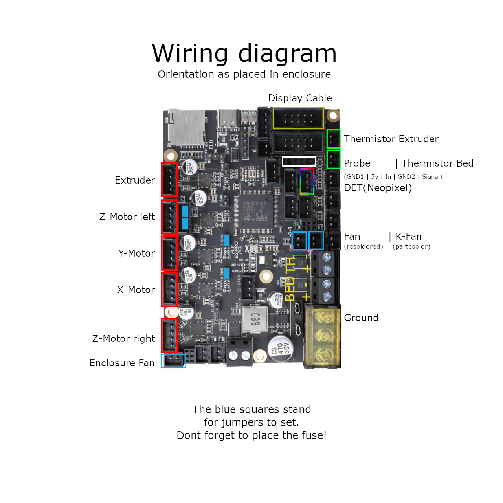

# CURRENT STATE:
# ✔️ UNDER APPROVAL, CHANGES MAY ACCOR ☑️


# ⚠️⚙️ Sovol SV06/+ Fly-E3-PRO-V3 conversion ⚙️⚠️

This GitHub contains the hardware conversion guide & Klipper configuration for the **Sovol SV06 Fly-E3-Pro-v3** and the Klipper-Config based on Bassamanators branch. The hardware conversion should fit the SV06+ but is untested yet. For more check out [Bassamanators](https://github.com/bassamanator/Sovol-SV06-firmware/tree/master) GitHub:

A short preview about what can you expect:
(not realtime, speedup for quicker overview)


I am creating these files for my personal use and cannot be held responsible for what it might do to your printer. Use at your own risk.

## Outline
- [Contribution](#contribution)
- [Preface](#preface)
- [Disclaimer](#Disclaimer)
- [Features](#features)
- [Stay Up-to-Date](#stay-up-to-date)
- [Hardware Conversion](#Hardware-Conversion)
  - [BOM](#BOM)
  - [Step 1 - Electrical wiring](#Step-1---Electrical-wiring)
  - [Step 2 - Disassemble the mobo-box and ribbon-cable](#Step-2---Disassemble-the-mobo-box-and-ribbon-cable)
  - [Step 3 - Modifing Extruder Ribbon-Cable](#Step-3---Modifing-Extruder-ribbon-Cable)
  - [Step 4 - Modifing Mobo enclosure](#Step-4---Modifing-Mobo-enclosure)
  - [Step 5 - Stepper wiring](#Step-5---stepper-wiring)
  - [Step 6 - Assembly](Step-6---#assebmly)
  - [Step 7 - Optional Neopixel](#Step-7---Optional-Neopixel)
  - [Hardware conversion sources](#hardware-conversion-sources)
- [Klipper Installation](#klipper-installation)
  - [Before You Begin](#before-you-begin)
  - [Flash Firmware](#flash-firmware)
  - [Download OSS Klipper Configuration](#download-oss-klipper-configuration)
- [Initial Steps](#initial-steps)
  1. [Adjust Configuration with MCU Path](#adjust-configuration-with-mcu-path)
  2. [Configure Your Printer](#configure-your-printer)
- [Adjust Your Slicer](#adjust-your-slicer)
- [Support Me](#support-me)
- [Directory Structure](#directory-structure)
- [FAQ](#faq)
- [Useful Resources](#useful-resources)
- [Sovol Official Links](#sovol-official-links)
- [Sources](#sources)

## Contribution
I want to thank [Bassamanator](https://github.com/bassamanator/Sovol-SV06-firmware/tree/sv06) for sharing his Klipper-Config, [Jan Oerter](https://www.youtube.com/user/MegaMuelleimer/) and [Dominik Schmidt](https://www.youtube.com/@dr.klipper) for their Anycubic i3 Mega conversion that inspired me for this project. Please check out [their GitHub](https://github.com/Schmelzerboy/I3-Mega-Klipper&ved=2ahUKEwj_2fKx-8qEAxW__7sIHc9iDd8QFnoECBUQAQ&usg=AOvVaw2BVSSPE56Auy_gCTLLL8iX) as well. Further I thank the big maker-Community in general for advice, help with troubleshooting and in general sharing all of your creation. Without you guys helping each other growing in knowledge this whole project wouldnt be possible. Youre breathtaking!

## Preface

This Mod includes manipulation of the hardware. If this mod doesnt work out for you, its reversable in majority. You have to live with some minor cosmetic changes of the mainboard enclosure.


I assume you have crimping and solder tools as well as a minimum of skills with these. I will provide as many as helpful sources as I can, to make it as easy as possible to handle the provided guide. If youre a beginner I will try my very best to hold your hand while doing this conversion. But keep in mind youre the only one that can be hold responsible if things go wrong.

Requirements:
- screw drivers
- soldering iron & flux
- crimptool for insulated Terminals
- shrink Tubes
- dupon Connectors
- heatgun
- pliers to cut and to Grab
- wire stripper
- helping hand
- small file(s)
- zipties

Even though I tried to make everything as easy as possible the prequesition is also youre familiar with Klipper. Over all I would recommend this Mod to advanced klipper-users which means you have at least used and modified Klipper once and understand most part of it.

> [!CAUTION]
> ## DISCLAIMER:
> 🔥⚡💀⚡🔥
>
> The conversion needs modification of the PSU wiring. There is the potential risk of frying components, damaging your machine, firehazard or worst threading your life when doing wrong. If you unshure how to do proceed stop right away and get help. Dont improvise at something that can potentialy threading your life when done improper! When turning on the machine first time after conversion I recommend having a fire extinguisher to hand for the worst case. Also please leave feedback and open an issue so this guide can be optimized. Read the complete guide with attention. I can not be hold accountable for any damage or injuries. Youre doing this at your own risk.
> 
> 🚨 Basic safety rules for electrical DIY 🚨:
> 1. Turn Off the machine and unplug the Power
> 2. Make shure it cant be plugged in or turned on again accidantial.
> 3. Don't be lazy but smart. Unplug and disassemble the parts you want to modify as far as possible to get them on a table.
> 4. Use proper tools.

## Features
- Harware:
  - Z-Tilt & Gantry Level to further improve parallel alignment to printbed.
  - silent Hotend-Fan while printer is idling. Optional PWM!
  - dedicated driver cooling fan. Optional PWM!
  - Optional: Neopixel with preconfigured effects for your printhead for better view and status feedback. 🔴🟢🔵
     - This Mod requieres a already installed mod for partcooling! Like [these](https://www.printables.com/de/model/685826-high-flow-ducts-for-sv06-single-and-double-5015-pa)
- Klipper:
   - This is basically provided by awesome Bassamanator. I only did minor changes. Most if it is copy&paste. Only the greatest masters are getting copyied so credit goes here to Bassamanator!
   - 💥 This Klipper configuration is an _endpoint_, meaning that it contains **everything** that you could possibly need in order to have an excellent Klipper experience! 💥
   - Minimum configuration settings for `Mainsail` and `Fluidd`.
   - Macros:
     - **Improved** mechanical gantry calibration/`G34` macro that provides the user audio feedback, and time to check the calibration.
     - Misc macros: `PRINT_START`, `CANCEL_PRINT`, `PRINT_END`, `PAUSE`, `RESUME`.
     - Parking macros (parks the printhead at various locations): `PARKFRONT`, `PARKFRONTLOW`, `PARKREAR`, `PARKCENTER`, `PARKBED`.
     - Load/unload filament macros.
     - `PURGE_LINE` macro.
     - `TEST_SPEED` macro. Find instructions [here](#how-do-i-use-the-test_speed-macro).
     - Custom Diplay Menu
     - Klipper Adaptive Meshing & Purging (KAMP) integrated. Read about it [here](#how-do-i-enable-kamp-klipper-adaptive-meshing--purging).

[🔼 Back to top](#outline)

## Stay Up-to-Date

${\normalsize{\textcolor{goldenrod}{\texttt{Star ⭐ this project.}}}}$

Watch for [updates]

[🔼 Back to top](#outline)

## Hardware Conversion
## BOM

This BOM is meant to give you an overview and some recommendation what is needed to get the conversion done. Some parts are essential,  some can be done by DIY. Some there are a few parts with prequesitions. I marked them on the pattern:
- essential :heavy_check_mark:
- DIY ⚙️
- prequesition :large_blue_diamond:
- optional: :small_orange_diamond:

For myself I'm not very familiar with crimping small connectors, neither I have the patience to. If youre better than me, you dont need to buy the stuff and use your DIY-Fu.

> [!CAUTION]
> ⚡ If you like to improvise: Dont improvise on the wiring. Use at least a diameter of AWG14 or 2,0mm². Thinner cables lead to a non reliable voltage supply for to mobo with may unexpected behavior or worse. ⚡

| Essential | Need for Step  | Part | Price | Source |
| ----- | ----- | ---- | ----- | ------ |
| :heavy_check_mark: | Assembly  | Fly-E3-Pro-V3 | ~40 Money  | [AliExpress](https://a.aliexpress.com/_EwY8p5L) |
| :heavy_check_mark: | wiring  | 200cm each AWG14 Red & Black  | ~4 Money  | [AliExpress](https://a.aliexpress.com/_ExgydLn)  |
| :heavy_check_mark: | wiring  | Cable Lug 3xSV2-4 & 3xSV2-5 | ~5 Money  | [AliExpress](https://a.aliexpress.com/_Exw61D7)  |
| :heavy_check_mark: | wiring  | MR60 Connector | ~6 Money  | [AliExpress](https://a.aliexpress.com/_EzVy9PX)  |
| :heavy_check_mark: | wiring  | Fabric Protection Tube (8mm ID) | ~1 Money  | [AliExpress](https://a.aliexpress.com/_EJrBNvF)  |
| ⚙️ | Soldering | 2x JST XH 2,54 2pins | ~ 1 Money | [AliExpress](https://de.aliexpress.com/item/32954418743.html?spm=a2g0o.order_list.order_list_main.29.564d5c5ftA02wT&gatewayAdapt=glo2deu)|
| ⚙️ | Soldering | 1x JST XH 2,54 3pins | ~ 1 Money | [AliExpress](https://de.aliexpress.com/item/32954418743.html?spm=a2g0o.order_list.order_list_main.29.564d5c5ftA02wT&gatewayAdapt=glo2deu)|
| ⚙️ | Soldering | 1x 5pin Female Dupont with wires | ~ 3 Money | [AliExpress](https://de.aliexpress.com/item/1005003638697583.html?spm=a2g0o.productlist.main.49.24cdbhKKbhKKDx&algo_pvid=dc7d4394-075d-4b5c-b441-6d431405c723&aem_p4p_detail=2024030500532316694723415837460000029320&algo_exp_id=dc7d4394-075d-4b5c-b441-6d431405c723-24&pdp_npi=4%40dis%21EUR%212.08%212.08%21%21%212.20%212.20%21%40211b619a17096288037974101e0a35%2112000026608429128%21sea%21DE%214565851420%21&curPageLogUid=ahmfexw1aSih&utparam-url=scene%3Asearch%7Cquery_from%3A&search_p4p_id=2024030500532316694723415837460000029320_5)|
| ⚙️ | Soldering | Alternative to Dupont wires | ~ 20 Money | [Local Amazon](https://www.amazon.de/dp/B0CLD7S5VC/?coliid=I2OEUBWMZKO5ZB&colid=3AEFYUODSS1J9&psc=1&ref_=list_c_wl_lv_ov_lig_dp_it)|
| ⚙️ |Stepper wiring| 50cm Stepper Wire | ~1 Money |[AliExpress]( https://a.aliexpress.com/_EHGpQVX) |
| ⚙️ |Stepper wiring| 80cm Stepper Wire | ~1 Money |[AliExpress]( https://a.aliexpress.com/_EHGpQVX) |
| :large_blue_diamond::small_orange_diamond: |Lighting| 4*1 Bit Neopixel | ~5 Money |[AliExpress](https://a.aliexpress.com/_EIiNKDR) |
| :heavy_check_mark: |Motivation| Xx cookies or sweets and a cup of hot drink 🍪🍬 | ~5 Money |Anywhere |


All described steps for the hardwareconversion follow this pattern:
## Step Name
Requirements:
- item A
- item B
   1. substeps 
> [!NOTE]
> A short overview what we about to do.

Prodecure:
1. description in small steps.
2. till everything is done.

## Step 1 - Electrical wiring
Requirements:
- AWG 14 wires
- MR60 Connector
- Cable Lugs
- Pliers
- Wirestripper
- Soldering iron
- Crimping tool

> [!NOTE]
> This is the Part for the PSU-wiring to MOBO. You need to cut the wires and the fabric in lenght, solder it with the connector and crimp the cable lugs.
> You may find this :tv:[video](https://youtu.be/w0pMjZ-rFQA?si=jAx5m2BBQhHhFl7G):tv: helpful for soldering.

Procedure:
1. Use the pliers tp cut the the materials in the length provided by this table:

| Quantity | Color  | Lenght | Needed for | 
| ----- | ----- | ---- | ----- |
| 2x | Red wire | 510 +/-10mm | connector to mobo |
| 1x | Black wire | 510 +/-10mm | connector to mobo |
| 2x | Red wire | 15 +/-5mm | PSU to connector |
| 1x | Black wire | 15 +/-5mm | PSU to connector |
| 1x | Protective fabric | 470 +/-10mm | connector to mobo |
| 1x | Protective fabric | 10 +/-10mm | PSU to connector |

> [!NOTE]
> The longer cables will now called CTM (connector to mobo) short cables PSUC (PSU to connector)

2. Solder PSUC

Strip one end and solder it into the male connector using the helping hand to hold it in place. Round is for ground. Take your time and do this proper. If done unproper this part is very likley to heat up and may catch fire! Dont forget to apply the click-on insulation after inspecting the solder joint and give it a approve.

3. Solder CTM

Repeat the process. Same rules. Use the female connector.

4. Apply fabric

Selfexplanotry. Do both wires and add a heatshrink to secure everything.

5. Crimping PSUC

Strip 6mm the one end left and crimp the SV2-5(Bigger Fork) on all three cables. 

6. Crimping CTM

Repeat the process mentioned at the 15mm wire with the SV2-4(smaller Fork) to the wires.

🍪🍬 DONE. Time for a cup of hot drink and a cookie or a sweet. 🍪🍬

[🔼 Back to top](#outline)
## Step 2 - Disassemble

Requirements:
- Pliers
- screwdriver with hexhead

> [!NOTE]
> You will disassemble the mobo-enclosure and stepper cables from your printer, your ribbon-cable and your motherboard from the enclosure.
> You will may find this :tv:[video](https://www.youtube.com/live/SQ4Nzgl77F8?si=rxNRZa5gnDLFytx2&t=866):tv: till timestamp 22:05 useful.

Procedure:
1. Turn off the machine and unplug power!
2. open the enclosure.
3. unscrew the terminals that power the board from the PSU.
4. unscrew the terminals for bed and remove unplug the thermistor.
5. unplug all stepper-cables.
6. cut all the zipties that inside the mobo-enclosure **be careful not to cut a wire accidently.**
7. gently remove all wires from the bottom-inlets.
8. unplug the ribbon-cable from the extruder-pcb, remove it from strain relieve.
9. unlock mobo-enclosure and remove the whole package from the printers frame with the ribbon-cable.
10. cut the zipties that hold the extruder-ribbon-cable, **Carefully again not to cut a wire accidently.**
11. get the whole package on a table and disassemble the ribbon-cable from the mobo.
12. unscrew the mobo and place it somewhere where its safe. If your conversion is successful you wount need it anymore.
13. the Y-stepper-cable and Dual-Z-stepper-cable are taped together. Gently peel of the tape so they're seperated after.
14. remove the Dual-Z-stepper-cable and keep it somewhere nice and dry. If the conversion is sucessful you wount need it anymore.

🍪🍬 DONE. Time for a cup of hot drink and a cookie or a sweet. 🍪🍬

[🔼 Back to top](#outline)

## Step 3 - Modifing Extruder Ribbon-Cable

Requirements:
- Wirestripper
- Soldering iron
- flux
- helping hand
- multimeter
- pliers

> [!NOTE]
> You need to modify your ribbon cable so it fits all the connectors at the Fly-E3-V3-Pro. Your cable is looking like schematic 1 down below and we need to converet it to schematic 2 also down below.

> [!TIP]
> If you having the spare toolhead laying around go and get it. It will be very helpful for this step. A spare toolhead pcb comes really handy as you can easily check if your wiring is as intended.

schematic 1: 

(click for lager picture)

schematic 2: 

(click for lager picture)

Procedure:
1. mark the cables for the probe with a tape so its easier to convert it. Mention the picture below.
2. cut the Probe-connector (red marked) cables strip ~3mm.
3. cut the Fan-ferrules (red marked) and strip ~3mm.
4. crimp or solder on the Dupont-connector on the stripped probe-cables.
5. crimp or solder on JST-Connector on the stripped fan-cables.
6. check the polarity of the FAN. Use the pinout shown in this step, switch if necessary. 
7. check the polarity of the K-FAN. Use the pinout shown in this step, switch if necessary.
8. check the pinout of the new probe-dupont-connector if it matches the Fly-E3-V3-pro.
9. switch port 1 and 3 of the DET-Connector using the pliers.
10. (Optional) remove the tape from the probe-connector.

> [!TIP]
> Its possible to leave out the soldering or crimping job with the probe connetor by getting one of [these](https://www.amazon.de/dp/B0CLD7S5VC/?coliid=I2OEUBWMZKO5ZB&colid=3AEFYUODSS1J9&psc=1&ref_=list_c_wl_lv_ov_lig_dp_it) and make an adapter. Its not really necessary and more costly but maybe this is a more convinient option for you if you dont mind spending some extra money.

Mind the pinout mentionend in the pictures below.

  

> [!CAUTION]
> I strongly recommend to check wiring with the multimeter and the toolhead pcb if everything is wired up correctly before calling this done.

🍪🍬 DONE. Time for a cup of hot drink and a cookie or a sweet. 🍪🍬

[🔼 Back to top](#outline)

## Step 4 - Modifing Mobo enclosure
Requirements:
- pliers
- small file - For myself I did it with a nail file

> [!NOTE]
> You need to modify the moobo-enclosure a little so it fits the Fly-E3-V3-Pro. This is the minor cosmetic change mentioned above when you decide to switch back later.

Procedure:
1. Cut the ribs with the pliers marked red in the picture. We need to do that to make room for the Wifi-Antenna at the backside of the board.
2. Sand the holes with the file ~1 up 2mm wider so the USB-connector and SD-Card-slot fit of the Fly-Mobo fit.
3. Test if the Fly mobo fits into the enclosure. If not check for for connectors especially the SD-slot as it stand out alot, I had to take a few tries getting it right.
4. If all is nice and snuggely clean the enclosure with water and dry it.


🍪🍬 DONE. Time for a cup of hot drink and a cookie or a sweet. 🍪🍬

[🔼 Back to top](#outline)

## Step 5 - Stepper wiring
Requirements:
- pliers

> [!NOTE]
> We prepare the bought two new stepper motor cables for the Z-steppers for correct wiring.

Procedure:
1. check the 4-pin-connector for orientation for both Z motor cables on the Fly-E3-Pro-V3.
2. use the pliers to remoove the pins on the motherboard connector. You can pinch on the pins with moderate force, they wount break. Bend the little nose up again befor inserting them back in their connector-housing. Mind the left sequence shown in the table below.
3. check the 6-pin connector for orientation of both cables on Z-steppers.
4. use the pliers to get the right orientation on stepper connector. Bend the little plastic-holders gently upwarts and remove the pins. **Dont try to push the pins, you will break them!**. Bend the nose back again before inserting them in their connector-housing. Mind the right sequence shown in the table below.

| ⚪ Motherboard (up to down)  | ⬜ Stepper (left to right) | 
| ----- | ---- |
| 🔴 | ⬛🟥🟩🟦 |
| 🔵 | |
| ⚫ | |
| 🟢 | |

If youre successfull it should look like this:

  

🍪🍬 DONE. Time for a cup of hot drink and a cookie or a sweet. 🍪🍬

[🔼 Back to top](#outline)

## Step 6 - Assembly
Requirements:
- pliers
- ziptie

> [!NOTE]
> We put everything together and check if the board is turning on after.

Procedure:
1. placing the motherboard
   1. place the jumpers and the fuse on the Fly-E3-V3-Pro if you havent already.
   2. place the heatsinks on all drivers.
   3. get the Fly-E3-V3-Pro and screw it into the motherboard enclosure using the four screws we saved from the disassembly.
2. electrical wiring
  1. get the cable we prepared earlier at [Step1](#Step-1---Electrical-wiring) and screw down the the lug connectors in the board. Terminal 3 is for ground. The other two are for voltage.
   2. Route the Power power cable we just screw in down in the opening. Dont ziptie yet!
3. Install ribbon cable
   1. get the modified ribbon cable and place it in the upper opening of the enclosure. Secure it with a ziptie.
   2. plug in all the cables from the extruder ribbon cable.
  
🖼️[mind the wiring diagram](#wiring-diagram)🖼️

>[!IMPORTANT]
> Mind the orientation of the modified sensor-dupont-connector! Mind the wiring diagram down below to get everything right. Close it after with the screw.

4. assemble enclosure
   1. place the enclosure at the printers-frame and lock it in place.
   2. screw in the bed power cables and the thermistor.
   3. Route the power cable in place. Its much more stiff now so its now bigger bend radius as we crossing your bed-cable. Dont worry it isnt an issue. Secure the two cables with a ziptie.

>[!IMPORTANT]
> Mind the picture below to get an idea what is mentioned here.

5. stepper wiring
   1. plug in the 20cm stepper motor cable at Z.
   2. plug in the Y stepper motor cable at Y.
   3. plug in the X stepper motor cable at X.
   4. plug in the 80cm stepper motor cable at E1 for the right stepper.
   5. route all the cables through the hole and secure them with a ziptie.

🖼️[mind the wiring diagram](#wiring-diagram)🖼️

>[!IMPORTANT]
> test if the motherboard-enclosure is closing properly. If not check for conflicts with the cables. **DONT TRY TO FORCE IT CLOSE, IT WILL BREAK!**

6. frame cable routing
   1. route the Y-stepper cable, the 80 cm stepper-motor-cable and the power cable underneath the Y-stepper. Secure them with a ziptie. Mind the 🖼️[frame visualization](#frame-visualization) to get an idea of what the procedure.
   2. route the 20cm stepper motor cable. underneath the left 2040 extrusion is plastic cover you need to remove. Mind the 🖼️[frame visualization](#frame-visualization).
   3. now route the cable inside the left extrusion and click in the cover over it to secure it.
   4. plug the 20cm stepper motor cable into the left stepper motor.
   5. there is also an extrusion cover under the right 2040 extrusion you need to remove.
   6. lift the frame a bit and losen the glued foot on the back right side by twisting it with moderate force. Do not remove completly! Mind the 🖼️[frame visualization](#frame-visualization).
   7. route the 80cm stepper motor underneath the foot and press it back on. 
   8. route the 80cm cable further to the motor and cover it with the plastic cover. Mind the 🖼️[frame visualization](#frame-visualization).
   9. Plug the cable into the right motor.

>[!IMPORTANT]
> check if everything is well routed. Move the bed slowly back and forth and sense if there is any resistance. Also check for any other potential collisions with the rerouted cables. If everything seems well proceed. If not check the uncutted zipties if theyre the source of the issues.

7. PSU wiring 
   1. disassemble the psu by release the two M4 bolts from the frame.
   2. disassemble the PSU-cover from PSU.
   3. release the two screws in the PSU terminal holding the the two wires.
   4. remove the cable with the connector.
   5. screw in the short cable you made at step 1. Mind the polarity on the PSU. **Double check a mistake May fry your board!***
   6. assembple back psu-cover and route the cable with connector trough the hole provided by the cover.
   7. screw psu back on the printers frame.
8. Final steps
   1. connect the MR60-connector so the board is provided with power.
   2. plug in the power supply.
   3. turn on the power supply. **🔥🧯 A fire extinguisher nearby is recommend. 🧯🔥**
   4. Check if the boards led's and the led of the probe lights up. When nothing is 💥burning/exploding🔥 or smell♨️ weird after 1 minute then everything seems to be fine.
   5. Cut all installed zipties so they dont infere with anything. Mind the 🖼️[frame visualization](#frame-visualization).
   6. close the mainboard enclosure.

### wiring diagram


### frame visualization


🥳 Congrats your conversion seems to be successfull at this point 🥳

[🔼 Back to top](#outline)

##  Step 7 - Optional Neopixel
Requirements:
- printed LED-holder (STL is in Folder 'STL')
- Helping Hand
- flux
- Solder iron
- 4*1 Bit Neopixel
- Superglue
- 1x JST XH 2,54 3pins with (pre)crimped connectors and 115 +/- 5mm AWG28 wire
- wirestripper
- pliers
- Two M3*6 screws

> [!NOTE]
> We are going to solder the wires in the Mini-Neopixel, glue it on the holder and then install it.

> [!IMPORTANT]
> to fullfil this step soldering skills beyond beginners level are required. I assume you had at least practiced once soldering on PCB's. 

1. Soldering
- place the Neopixel in the helping hand and clamp it down.
- strip around 2mm of the three AWG 28 wires
- apply flux on the pads on the backside and apply tin. Go short and hot.
- now place the cables over the three pads and clamp them with the helping hand very close over the pads so they cant move. Its kinda tricky because the pads are really close to each other but you can make it! Believe in yourself!
- apply some flux again over the cables. 
- now its time to solder the cables on the pretinned pads. I recommend starting with DIN and work your way to GND. But it honestly doesnt matter where you start as long as you get the job done and dont burn the insulation. So very short and hot is how you can get this job done. 🟡=In 🔴=5V ⚫=GND Mind the 🖼️[Hotend PCB pinout](#Hotend-PCB-pinout)
- check for shorts. If everything seems fine lay it aside.
- Installation
   1. I recommend to install Klipper first, test the Neopixel without holder and then proceed. But you can do as well.
   2. route the cables in the grove with the pliers and gently press the PCB down till everything fits. Its fiddly and timeconsuming but its worth the trouble. Dont use any more force then like while holding a pen for writing. If there is alot of resistance lift the PCB and reroute the cables. The PCB should go in with a slight click.
   3. Everything sits nice, lift it again and apply two drops of superglue to fix the PCB on the holder. Press it on with moderate force for 30 seconds and let it set for 4 hours.
   4. While the glue is setting you can route the cables through the small groove using the pliers.
   5. after waiting for the glue to dry screw the holder into the two provided holes for the former partcooler and connect the neopixel to the printhead PCB. Mind the correct wiring, switch if necessary. I the cable is a little too long you can route it behind the PCB and then plug the connector in.
   6. secure the cable with a small ziptie on the probes cable to it cant touch the heating block.

### Hotend PCB pinout


🆒 Congrats you added RGB, quality of live and level of coolness improved 😎

[🔼 Back to top](#outline)

## Hardware conversion sources
- [Blakadder](https://sv06.blakadder.com/Parts/electronic-parts/)
- [th3dstudio](https://support.th3dstudio.com/helpcenter/ezboard-v2-sovol-sv06-stock-abl-sensor-wiring/)
- [TeamGloomy](https://teamgloomy.github.io/fly_e3_pro_v3_general.html)
# Klipper Installation
## Before You Begin

- This entire page is a **9 minute read**. Save yourself _hours of troubleshooting_ and read this documentation fully.
- ⚠️ Make sure your printer is in good physical condition, because print and travel speeds will be _a lot faster_. Beginners would be wise to run through [these steps](https://github.com/bassamanator/everything-sovol-sv06/blob/main/initialsteps.md).
- ⚠️ [Disable](https://github.com/bassamanator/everything-sovol-sv06/blob/main/howto.md#disable-usb-cable-5v-pin) the USB cable's 5V pin.
- Follow the steps in order. If an error was reported at a step, do no proceed to the next step.
- It is assumed that you are connected to your host Raspberry Pi (or other host device) via SSH, and that your printer motherboard is connected to the host via a data USB cable. 💡 Most of the micro USB cables that you find at home are _unlikely_ to be data cables, and it is not possible to tell just by looking.
- It is also assumed that the username on the host device is `pi`. If that is not the case, edit `moonraker.conf` and `cfgs/misc-macros.cfg` to change any mentions of `/home/pi` to `/home/yourUserName`.
- Klipper _must_ be installed on the host beforehand. Easiest is to use [MainsailOS](https://github.com/mainsail-crew/mainsail/releases/latest). [KIAUH](https://github.com/th33xitus/kiauh) is another option.
- Klipper _must_ be up to date.
  - In `Fluidd`, you can do this from `Settings` > `Software Updates`.
  - In `Mainsail`, you can do this from `Machine` > `Update Manager`.
- Robert Redford's performance in _Spy Game (2001)_ was superb!
- It is assumed that there is one instance of Klipper installed. If that is not the case, the steps in this guide will not work _perfectly_ for you.
- Your question has probably been answered already, but if it hasn't, please post in the [Discussion](https://github.com/bassamanator/Sovol-SV06-firmware/discussions) section.
- I would recommend searching for the word `NOTE` in this configuration. There are roughly half a dozen short points amongst the various files that you should be aware of.
<!-- - Link to recommended parts. -->

[🔼 Back to top](#outline)

## Compile Firmware
- SSH into your Klipper host and compile the firmware for your printer using the following setup:

[*] Enable extra low-level configuration options

Micro-controller Architecture (STMicroelectronics STM32)  --->

Processor model (STM32F407)  --->

Bootloader offset (32KiB bootloader)  --->

Clock Reference (8 MHz crystal)  --->

USB ids  --->

()  GPIO pins to set at micro-controller startup

## Flash Firmware

⏲️ At this point, it's not possible to tell with certainty whether your flash was successful, continue on with the guide.

[🔼 Back to top](#outline)

## Download OSS Klipper Configuration

## Method 1: Clone the Repository

💡 Make sure `git` is installed (`sudo apt update && sudo apt install git`).

1. `cd ~/printer_data/config`
2. Empty entire `~/printer_data/config` folder.
   - In linux, you can delete files via `rm fileName` and directories via `rmdir directoryName`.
   - In linux, you can list files and folders via `ls -lah`.
3. `git clone -b master --single-branch https://github.com/bassamanator/Sovol-SV06-firmware.git .` ⚠️ Don't miss the period!

## Method 2: Download the ZIP

1. [Download](https://github.com/bassamanator/Sovol-SV06-firmware/archive/refs/heads/master.zip) the `ZIP` file containing the Klipper configuration.
2. See `Step 2` in `Method 1`.
3. The parent folder in the `ZIP` is `Sovol-SV06-firmware-master`. This is relevant in the next step.
4. Extract **only** the _contents_ of the parent folder into `~/printer_data/config`.

[🔼 Back to top](#outline)

## Initial Steps

## Adjust Configuration with MCU Path

💡 Make sure the host and printer are connected via USB.

1. Find what port the `mcu` (printer motherboard) is connected to via _one_ of the following commands:

   - `ls /dev/serial/by-id/*`
   - `ls /dev/serial/by-path/*`

   1. The output will be something along the lines of
      - `/dev/serial/by-id/usb-1a86_USB2.0-Serial-if00-port0`

2. Adjust the `[mcu]` section in `printer.cfg` accordingly.

   ```yaml
   # 📝 This is just an example
   [mcu]
   serial: /dev/serial/by-id/usb-1a86_USB2.0-Serial-if00-port0
   restart_method: command
   ```

3. Do a `FIRMWARE_RESTART`.

If the Klipper flash that you did earlier was successful, and you've done everything else correctly, you should see no errors or warnings in the `Mainsail`/`Fluidd` dashboard. 🎉 **Your printer has been Klipperized!** 🎉

[🔼 Back to top](#outline)

## Configure Your Printer and initial setup

❗☠️ **Your finger should be on the power switch for most of these steps** ☠️❗

❗☠️ **Power off if there is a collision/problem** ☠️❗

💡 The ${\small{\textcolor{red}{\texttt{EMERGENCY STOP}}}}$ button in your dashboard works faster than hitting the power switch.

💡 Do a practice emergency stop.

💡 I recommend no filament be loaded for any of these steps.

💡 Check if you get correct temperature reading from the bed and hotend. It should correspond with your roomtemperature.

💡 Check if your hotend and bed heats up when you enter a number at the temperatures setting.

💡 Check if the hotend fan and partcooler fan are working. First one should start as you start heating the hotend, the second one you can activate via `Mainsail`/`Fluidd`.

📝 You will be pasting/typing these commands into the `Mainsail`/`Fluidd` console.

1. Check to see if `X` and `Y` max positions can be reached, and adjust `position_max`, if necessary. You might be able to go further, which is great, but I recommend leaving a 2mm gap for safety.
   1. `G28`
   2. `G90`
   3. `G1 X223 F3000`
   4. `G1 Y223 F3000`
2. Do a mechanical gantry calibration; `G34`. After the controlled collision against the beam at the top, there will be a 10 second pause for you to verify that both sides of the gantry are pressed up against the `stoppers` at the top. You will hear a succession of beeps.
   1. Figure out your `Z` `position_max` by baby stepping your way up to the beam, and adjust `position_max`, if necessary.
   2. OPTIONAL: Now you can use Z-Tilt
3. PID tune the bed. Ideally, all PID tuning should occur at the temperatures that you print most at.
   1. `PID_TEST_BED TEMP=70`
   2. `SAVE_CONFIG` (once completed)
4. PID tune the extruder while part cooling fan runs at 25%.
   1. `PID_TEST_HOTEND TEMP=245`
   2. `SAVE_CONFIG` (once completed)
5. Calibrate X-Twist-Compensation. Make sure your nozzle if very clean. Follow the wizard and do the [Paper test](https://www.klipper3d.org/Bed_Level.html?h=probe_calibrate#the-paper-test).
   1. `AXIS_TWIST_COMPENSATION_CALIBRATE ` 
6. Adjust `z_offset`. Make sure your nozzle if very clean. Do the [Paper test](https://www.klipper3d.org/Bed_Level.html?h=probe_calibrate#the-paper-test).
   1. `DO_PROBE_CALIBRATE`
   2. Follow `z_offset` setup in `Mainsail`/`Fluidd`.
   3. `SAVE_CONFIG` (once completed)
7. Create a bed mesh.
   1. `DO_CREATE_MESH`
   2. `SAVE_CONFIG` (once completed)

>[!IMPORTANT]
> For future calibration after initial setup of your printer use:
> 1. `mechanical gantry calibration`
> 2. `screw tilt calculate` (if you have the required modifications)
> 3. `Z-Tilt` to archieve the best first layer possible.

🏁 If you've made it here, then your Klipperized and modded printer is ready to print! 🏁

_But first_, adjust your slicer.

[🔼 Back to top](#outline)

## Adjust Your Slicer

📝 If you are using the slicer bundles found on this repo, you can skip this section.

### Start G-Code

It varies depending on your slicer. Find instructions [here](https://ellis3dp.com/Print-Tuning-Guide/articles/passing_slicer_variables.html#slicer-start-g-code).

## End G-Code

```
PRINT_END
```

## Line Purge

If you would like to print a purge line before your print starts, at the end of your start gcode, on a new line, add one of the following:

- `PURGE_LINE`; prints a standard purge line.
- `LINE_PURGE`; prints KAMP's purge line. ⚠️ Do not attempt to use without reading [this section](#how-do-i-enable-kamp-klipper-adaptive-meshing--purging).

```yaml
# 📝 This is just an example Start G-Code
PRINT_START ...
PURGE_LINE
```

[🔼 Back to top](#outline)

## Directory Structure

This repository contains many files and folders. Some are _necessary_ for this Klipper configuration to work, others are not.

- **Necessary** items are marked with a ✅.
- Items that can _optionally_ be deleted are marked with a 💠.
<!-- tree -a -C -I '.directory' -L 1 -F -->

```sh
├── cfgs/ ✅
├── stl/ 💠
├── CODE_OF_CONDUCT.md 💠
├── CONTRIBUTING.md 💠
├── .git/ ✅❔
├── .github/ 💠
├── .gitignore ✅❔
├── images/ 💠
├── LICENSE 💠
├── misc/ 💠
├── moonraker.conf ✅
├── osskc.cfg ✅
├── printer.cfg ✅
├── README.md 💠
├── SECURITY.md 💠
└── .vscode/ 💠
```

[🔼 Back to top](#outline)
